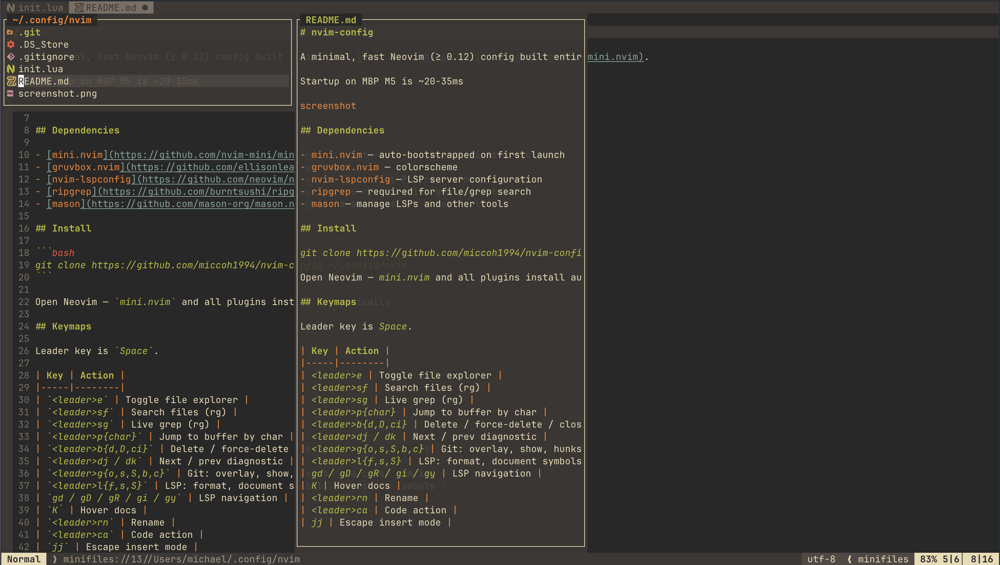

# nvim-config

A minimal, fast Neovim (≥ 0.12) config built entirely on [mini.nvim](https://github.com/nvim-mini/mini.nvim).

Startup on MBP M5 is ~20-35ms



## Dependencies

- [mini.nvim](https://github.com/nvim-mini/mini.nvim) — auto-bootstrapped on first launch
- [gruvbox.nvim](https://github.com/ellisonleao/gruvbox.nvim) — colorscheme
- [nvim-lspconfig](https://github.com/neovim/nvim-lspconfig) — LSP server configuration
- [ripgrep](https://github.com/burntsushi/ripgrep) — required for file/grep search
- [mason](https://github.com/mason-org/mason.nvim) — manage LSPs and other tools

## Install

```bash
git clone https://github.com/miccoh1994/nvim-config ~/.config/nvim
```

Open Neovim — `mini.nvim` and all plugins install automatically.

## Keymaps

Leader key is `Space`.

| Key | Action |
|-----|--------|
| `<leader>e` | Toggle file explorer |
| `<leader>sf` | Search files (rg) |
| `<leader>sg` | Live grep (rg) |
| `<leader>p{char}` | Jump to buffer by char |
| `<leader>b{d,D,ci}` | Delete / force-delete / close inactive buffers |
| `<leader>dj / dk` | Next / prev diagnostic |
| `<leader>g{o,s,S,b,c}` | Git: overlay, show, hunks, branches, commits |
| `<leader>l{f,s,S}` | LSP: format, document symbols, workspace symbols |
| `gd / gD / gR / gi / gy` | LSP navigation |
| `K` | Hover docs |
| `<leader>rn` | Rename |
| `<leader>ca` | Code action |
| `jj` | Escape insert mode |

## LSP

Servers are configured at the bottom of `init.lua`. Uncomment the ones you need and ensure the server binary is on your `$PATH`.
